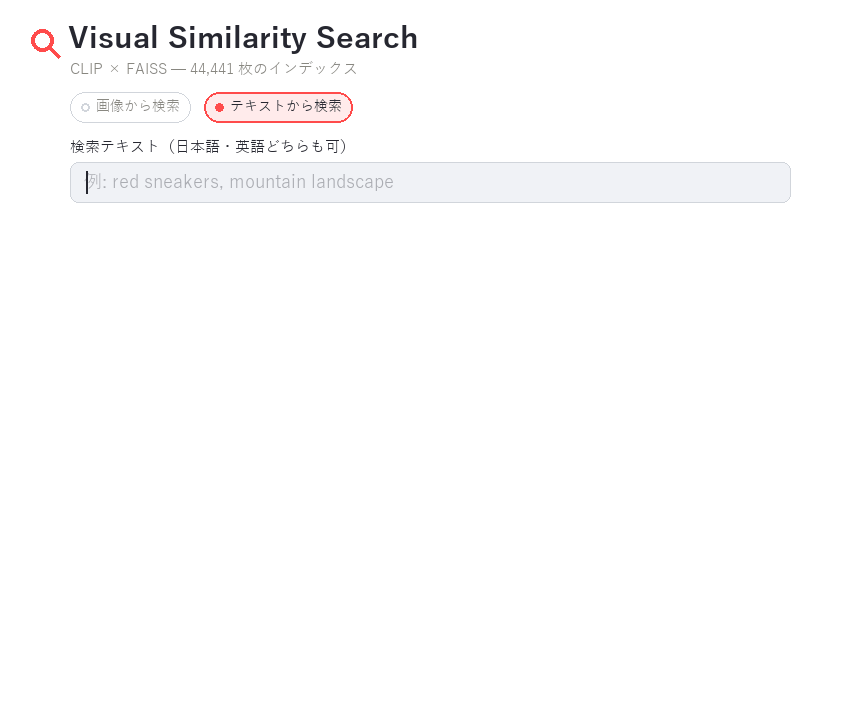
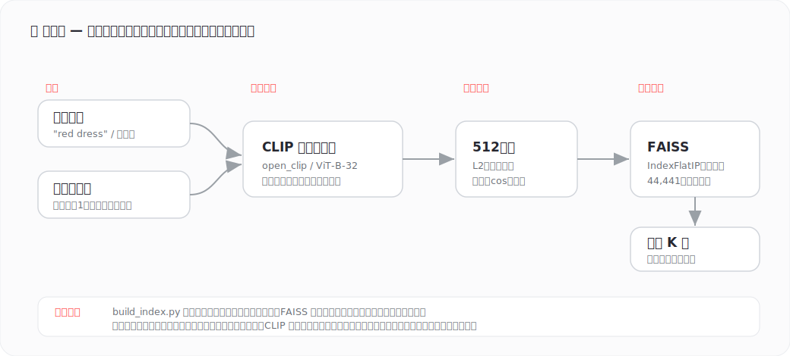

# 🔍 ビジュアル類似性検索（Visual Similarity Search）

多言語 CLIP × FAISS によるテキスト・画像検索アプリ。
キーワード（**日本語・英語**）や手持ちの画像から、画像コレクションの中で意味的に近いものを検索できます。

CLIP は画像とテキストを同じベクトル空間に埋め込むため、テキストだけで画像をゼロショット検索できます。

## デモ

「red dress」「running shoes」のようにキーワードを入力すると、約4.4万枚の中から似た画像を即座に提示します。



## 仕組み



## 構成

| ファイル | 役割 |
|----------|------|
| `app.py` | Streamlit 製の検索 UI |
| `encoder.py` | CLIP による画像/テキストのベクトル化 |
| `indexer.py` | FAISS（内積＝コサイン類似度）による近傍検索 |
| `build_index.py` | 画像フォルダからインデックスを構築するスクリプト |
| `app_start.bat` | Windows 用のワンクリック起動バッチ |

> 注: 画像データ (`data/`) と生成済みインデックス (`index/`) はリポジトリに含めていません。
> 各自で画像を用意し、`build_index.py` でインデックスを構築してください。

## セットアップ

```bash
python -m venv .venv
.venv\Scripts\activate          # Windows
pip install -r requirements.txt
```

## 使い方

### 1. インデックスを構築（初回のみ）

検索対象の画像を `data/images/` に置き、以下を実行します。

```bash
python build_index.py --image-dir data/images --index-dir index
```

対応形式: `.jpg .jpeg .png .webp .bmp`

### 2. アプリを起動

```bash
streamlit run app.py
```

Windows では `app_start.bat` をダブルクリックでも起動できます。
ブラウザで `http://localhost:8501` が開き、テキスト/画像で検索できます。

## 技術スタック

- **多言語 CLIP** (`open-clip-torch`, `xlm-roberta-base-ViT-B-32` / `laion5b_s13b_b90k`) — 画像・テキストの埋め込み。XLM-RoBERTa テキストタワーにより日本語クエリにも対応
- **FAISS** (`faiss-cpu`) — 高速な近傍検索
- **Streamlit** — Web UI

## ライセンス

MIT
